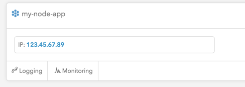

# Deploying a Node+Mongo Application on the Catalyze Platform

In this guide we will cover how to deploy a simple [Node.js](https://nodejs.org/) application that stores data in a [MongoDB database](https://www.mongodb.org/).

## Pre-requisites

Before getting started, make sure you created your Catalyze account, have signed any [business associate agreements](https://catalyze.io/learn/business-associate-agreements) with Catalyze as necessary, and have successfully provisioned an environment with a code service and a MongoDB service. If you need help getting started, hop on over to the [PaaS Getting Started](https://resources.catalyze.io/paas/getting-started/) guide available on our [resources site](https://resources.catalyze.io/).

You should also have Git, Node.js, NPM, Mongo, and the [Catalyze CLI](https://resources.catalyze.io/paas/getting-started/the-paas-cli/) installed and available on your system path.

## Local Node.js Application

To get started we will create a simple Node.js application using the [Express framework](http://expressjs.com/). If you want to cut down on typing you can [clone the sample app from GitHub](https://github.com/catalyzeio/nodejs-example-app).

1. Create a `package.json` file with a dependency on `express` and `mongodb`.

   ```
   {
     "name": "catalyze-nodejs-mongo-demo",
     "description": "Sample Node.js application for the Catalyze PaaS platform",
     "version": "0.0.1",
     "main": "index.js",
     "scripts": {
       "start": "node index.js"
     },
     "engines": {
       "node": ">=0.10.0"
     },
     "dependencies": {
       "express": "^4.9.5",
       "mongodb": "^1.4.12"
     }
   }
   ```

2. Use `npm` to pull down your dependencies.

   ```
   $ npm install
   ```

3. Add a basic `index.js` file. Feel free to adapt the "Hello, world!" one below.

   ```
   "use strict";

   var express = require("express");

   var app = express();
   app.get("/", function (req, res) {
       res.send("Hello, world!");
   });

   var port = process.env.PORT || 8088;
   app.listen(port, function () {
       console.log("listening on port " + port);
   });
   ```

4. Run it, then point your browser to [http://127.0.0.1:8088](http://127.0.0.1:8088) to see it working.

```
$ npm start
```

5. Create a new Git repo and add your new files.

```
$ git init
Initialized empty Git repository in /some/path/test/.git/
$ echo node_modules > .gitignore
$ git add .gitignore index.js package.json
$ git commit -m "Initial commit"
[master (root-commit) b8626d7] Initial commit
 3 files changed, 31 insertions(+)
 create mode 100644 .gitignore
 create mode 100644 index.js
 create mode 100644 package.json
```

## Building and Deploying the Application

To deploy the application, a git remote must be set up using the [Catalyze CLI](https://github.com/catalyzeio/catalyze-paas-cli).

1. Associate the local project with your provisioned environment.

   ```
   $ catalyze associate my-node-app
   ```

   This will add a new git remote named `catalyze` to that local repo. It will ask for credentials - these are the username and password that you use in the dashboard.

2. Push master to catalyze to build your code.

   ```
   $ git push catalyze master
   ```

3. You should see build output after you push. After pushing, you can check the environment status - the build status should now be finished.

   ```
   $ catalyze status
   environment state: deployed
    app01 (size = c1, build status = finished, deploy status = None)
    mongo01 (size = c1, image = mongodb, status = running)
   ```

3. Ask Catalyze to deploy that build to your environment. After it's deployed, the `deploy status` will change to `running`.

## Mongo Integration

TODO

## Redeploying the Application with Mongo

All that is required to rebuild a codebase with changes and redeploy is a single push.

```
$ git push catalyze master
```

No need to talk to Catalyze - the redeploy will happen automatically if the build is successful.

## Working with Logs

In the Catalyze dashboard, when you select your environment from the left sidebar, a button is available to access an exposed Kibana + ElasticSearch interface.



Docs and guides for ElasticSearch and Kibana can be found [here](http://www.elastic.co/guide/).


## Redeploying with Log Integration

Just another push to redeploy.

```
$ git push catalyze master
```
